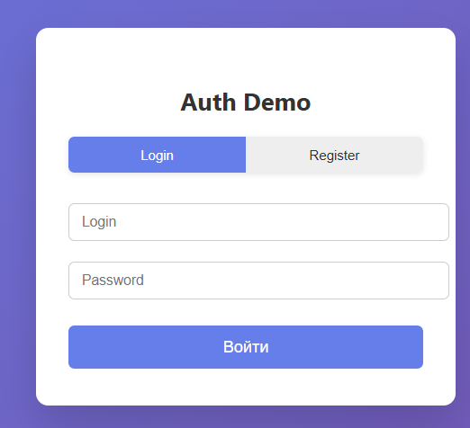
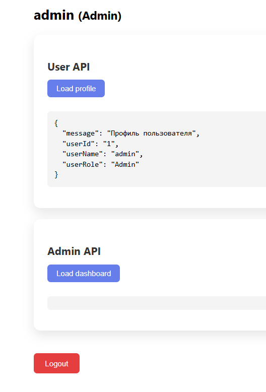
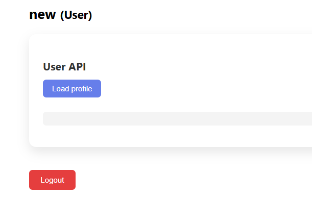

# Auth Service Demo
Это пример полного приложения **React + ASP.NET Core** с авторизацией через JWT, использованием **cookie**, разделением доступа по ролям и демонстрацией работы API.
---
## 🔹 Backend
### 1. Entity: 
- `User`
- `Role
---
### 2. AuthService
Сервис выполняет ключевые задачи:

1. **Регистрация** (`Register`):
- Проверяет, существует ли login
- Хэширует пароль с помощью BCrypt
- Создаёт пользователя в БД
- Генерирует JWT токен и возвращает его вместе с данными пользователя (`AuthResponseDto`)
2. **Авторизация** (`Login`):
- Находит пользователя по login
- Проверяет пароль через BCrypt
- Генерирует JWT токен и возвращает его с данными пользователя
---
### 3. Контроллеры
- **AuthController**: `/login`, `/register`, `/logout`, `/me`, `/validate`
- `/login` и `/register` устанавливают JWT в **куки**:
- `/me` возвращает данные текущего пользователя из токена
- `/validate` проверяет токен

- **UserController**: `/profile`, `/info`
- Требует аутентификации `[Authorize]`
- Доступ к `/info` можно ограничить ролями `[Authorize(Roles="User,Admin")]`

- **AdminController**: `/dashboard`, `/users`
- Доступ только для `[Authorize(Roles="Admin")]`
---
### 4. JWT и куки
#### 1. Запрос на авторизацию

`[Фронтенд] → POST /login или /register→ [Бэкенд]`
- Эндпоинт public - без проверки токена
- AuthService получает логин/пароль
- Проверяет в БД

#### 2. Генерация токена

в AuthService метод `GenerateJwtToken(User user)`

```
GenerateJwtToken(user)  // ← использует JwtSettings из DI
{
    ключ = _jwt.SecretKey      // для подписи
    issuer = _jwt.Issuer       // кто выпустил
    claims: claims
    audience = _jwt.Audience   // для кого
    expires = _jwt.ExpireMinutes  // когда истечет срок работы токена
}

// claims - дополнительные поля, которые хранит токен (информация о пользователе)
 var claims = new List<Claim>
 {
     new Claim(ClaimTypes.NameIdentifier, user.Id.ToString()),
     new Claim(ClaimTypes.Name, user.Login!),
     new Claim(ClaimTypes.Role, user.Role?.Name ?? "User"),
     new Claim("UserId", user.Id.ToString()),
     new Claim("RoleId", user.RoleId.ToString())
 };
```

в `Startup.cs` находятся настройки для JWT
```
 var jwtSettings = new JwtSettings
 {
     SecretKey = "your-very-long-secret-key-at-least-32-characters-here", // секретный ключ
     Issuer = "AuthService", // кто выпустил
     Audience = "AuthClient", // для кого
     ExpireMinutes = 60 // когда истечет срок работы токена

 };
```
 
#### 3. Отправка клиенту

в AuthController в /login, /register

```
 Response.Cookies.Append("auth_token", response.Token, new CookieOptions
 {
     HttpOnly = true,
     Secure = true,
     SameSite = SameSiteMode.Strict,
     Expires = response.Expires
 });
return Ok
```
#### 4. Последующие запросы
```
[Фронтенд] → GET /me (c куки auth_token) → [ASP.NET Core]
                                          ↓
                              JwtBearerMiddleware (перехват!)
```
JwtBearerMiddleware - часть ASP.NET, которая отвечает за обработку токена

JwtBearerMiddleware автоматически:
- Достает токен из куки (OnMessageReceived)
- Проверяет подпись (IssuerSigningKey)
- Проверяет издателя (ValidIssuer)
- Проверяет получателя (ValidAudience)
- Проверяет срок (exp)
- Если всё ок - направляет запрос дальше к классам Controller, Service

Бэкенд проверяет роли через [Authorize(Roles="Admin")], фронтенд показывает панели только для нужной роли

#### Выход из аккаунта
при выполнении запрос `/logout` очищаются куки 
```
 [HttpPost("/logout")]
 [Authorize]
 public IActionResult Logout()
 {
     Response.Cookies.Delete("auth_token");
     return Ok(new { message = "Вы успешно вышли из системы" });
 }
```
на фронтенде переход на страницу авторизации

### Frontend
Для работы с куки используется метод, с помощью которого все запросы идут через apiFetch:

`const API_URL = "https://localhost:7093";`


```
export async function apiFetch(url, options = {}) {
   const response = await fetch(`${API_URL}${url}`, {
       ...options,
       credentials: "include", // 🔥 обязательно для cookie
       headers: { "Content-Type": "application/json", ...(options.headers || {}) }

   });
   if (!response.ok) {
       const error = await response.json();
       throw new Error(error.message || "API error");
   }
   return response.json();

}
```
Этот запрос используют методы:

- `login(login, password)`
- `register(name, login, password)`
- `logout()`
- `me()` - получает данные текущего пользователя
- `adminDashboard()` - доступно только Admin
- `userProfile()`  - доступно для всех

```
┌─────────┐    1. POST /login      ┌──────────┐
│ Клиент  │ ──────────────────────> │          │
│         │                        │          │
│         │    2. Генерация JWT    │  Auth    │
│         │     (AuthService)      │ Service  │
│         │                        │          │
│         │    3. Cookie: token    │          │
│         │ <────────────────────── │          │
└─────────┘                        └──────────┘
     │                                   ▲
     │ 4. GET /me (c cookie)            │
     │ ──────────────────────────────────┘
     │                              [JwtBearer]
     │                              Проверка:
     │                              ✓ Подпись
     │                              ✓ Срок
     │                              ✓ Issuer/Audience
     │
     ▼
[HttpContext.User] ← создан из токена
```

### 5. Разделение по ролям

Фронтенд из запроса /me получает данные о пользователе и сохраняет в `user`, по `role` внутри `user` определяет роль и отображает компоненты
```
{user.role === "Admin" && <AdminPanel />}
<UserPanel /> // для всех
```

Backend дополнительно проверяет права через [Authorize(Roles="Admin")] и [Authorize(Roles="User,Admin")]

## DEMO


