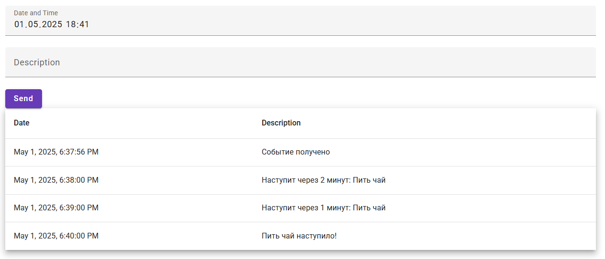

# Java WebSocket + BFF
Получение уведомлений о наступлении события

Java 23

Resourse Server: Java Spring Cloud использует планировщик scheduler, для проверки времени

BFF: Java Spring WebSocket

Client: Angular

realm-export.json - настройки keycloak

