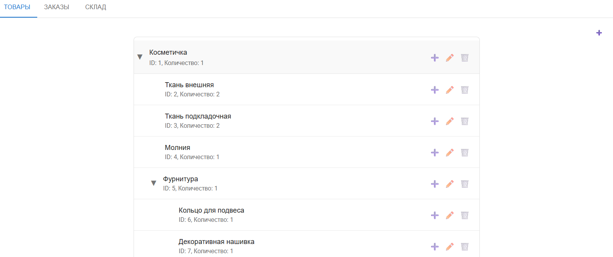
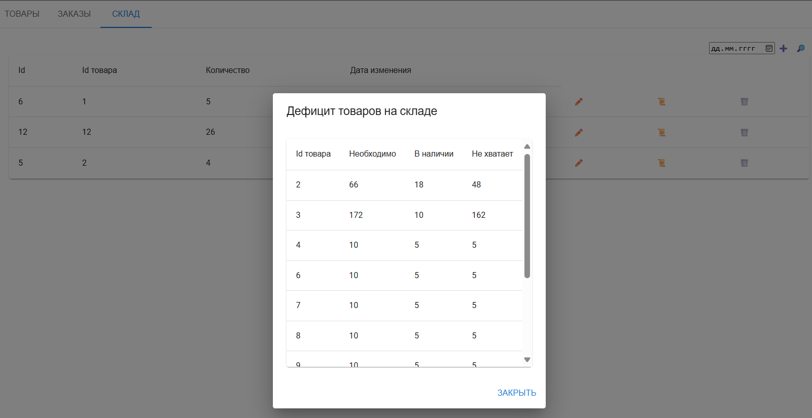
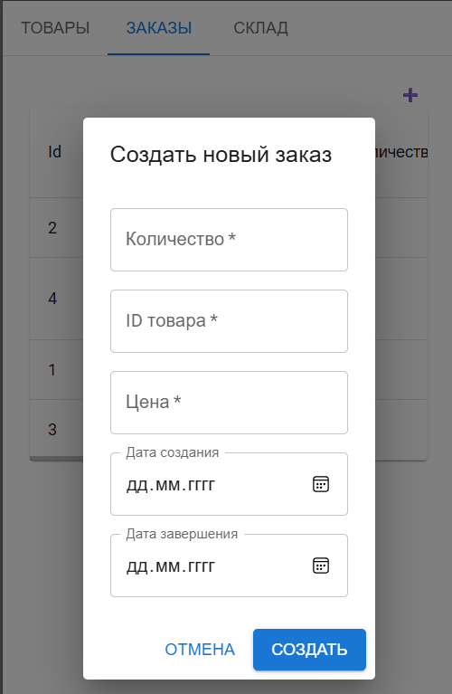

# Products-simple

## Установка
### База данных
PostgreSQL, в которой пустая бд с названием Kis

### Backend и миграция
**обновить Visual Studio и .net (sdk)**

скачать и распоковать архив

открыть backend/kis.sln

ctrl + ё

прописать:
``` 
cd kis
 dotnet ef migrations add InitialCreate
 dotnet ef database update
```
### Frontend
установить [Node.js](https://nodejs.org/en/download)

через `cmd` в директории frontend прописать
`npm install`

Тестовые данные таблицы Specification

```
INSERT INTO public."Specification"("Level", "Name", "Count", "Parent_id") VALUES
-- Основной продукт - Косметичка (уровень 0)
(0, 'Косметичка', 1, NULL),

-- Основные компоненты (уровень 1)
(1, 'Ткань внешняя', 2, 1),
(1, 'Ткань подкладочная', 2, 1),
(1, 'Молния', 1, 1),
(1, 'Фурнитура', 1, 1),

-- Компоненты фурнитуры (уровень 2)
(2, 'Кольцо для подвеса', 1, 5),
(2, 'Декоративная нашивка', 1, 5),

-- Дополнительные материалы (уровень 1)
(1, 'Нитки', 1, 1),
(1, 'Утеплитель', 1, 1),
(1, 'Клей', 1, 1),

-- Компоненты декора (уровень 1)
(1, 'Декоративные элементы', 1, 1),
(2, 'Бисер', 10, 10),
(2, 'Стразы', 5, 10),
(2, 'Аппликация', 1, 10);
```


## Запуск
Запустить проект Visual Studio

frontend через
```
@echo off
npm start
pause
```

либо через cmd 

`npm start`






