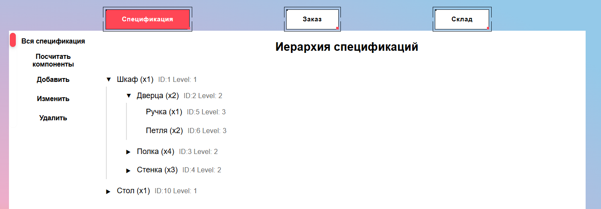
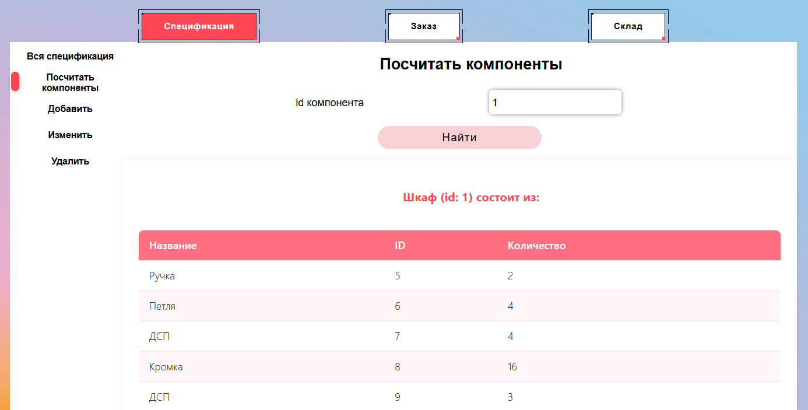
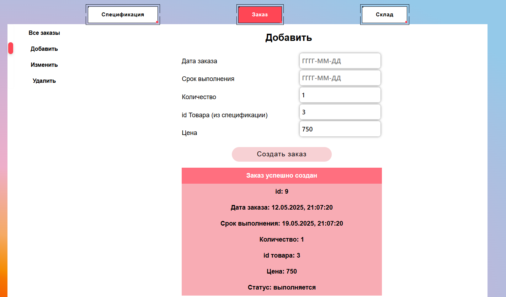

# Products
## Установка
### База данных
PostgreSQL, в которой пустая бд с названием `KIS`, пользователь: `postgres`, пароль: `rootroot`.

или подкорректировать строку подключения в backend/kis/Startup.cs

```
var connectionString = "Server=localhost;Port=5432;Database=KIS;User Id=postgres;Password=rootroot;";
```
### Backend и миграция
**обновить Visual Studio и .net (sdk)**

скачать и распаковать [архив](https://github.com/gKonstantin17/prog-templates/releases/tag/react-cSharp)

открыть backend/kis.sln

ctrl + ё

прописать:
``` 
cd kis
 dotnet ef migrations add InitialCreate
 dotnet ef database update
```
### Frontend
установить [Node.js](https://nodejs.org/en/download)

через `cmd` в директории frontend прописать
`npm install`

**Тестовые данные таблицы Specification**

```
INSERT INTO public."Specification" ("Level", "Name", "Count", "ParentId") VALUES
(1, 'Шкаф', 1, NULL),
(2, 'Дверца', 2, 1),
(2, 'Полка', 4, 1),
(2, 'Стенка', 3, 1),
(3, 'Ручка', 1, 2),
(3, 'Петля', 2, 2),
(3, 'ДСП', 1, 3),
(3, 'Кромка', 4, 3),
(3, 'ДСП', 1, 4),
(1, 'Стол', 1, NULL),
(2, 'Столешница', 1, 10),
(2, 'Ножка', 4, 10),
(3, 'ДСП', 1, 11),
(3, 'Кромка', 4, 11);
```

## Запуск
Запустить проект Visual Studio


Frontend через cmd в директории frontend

`npm start`







