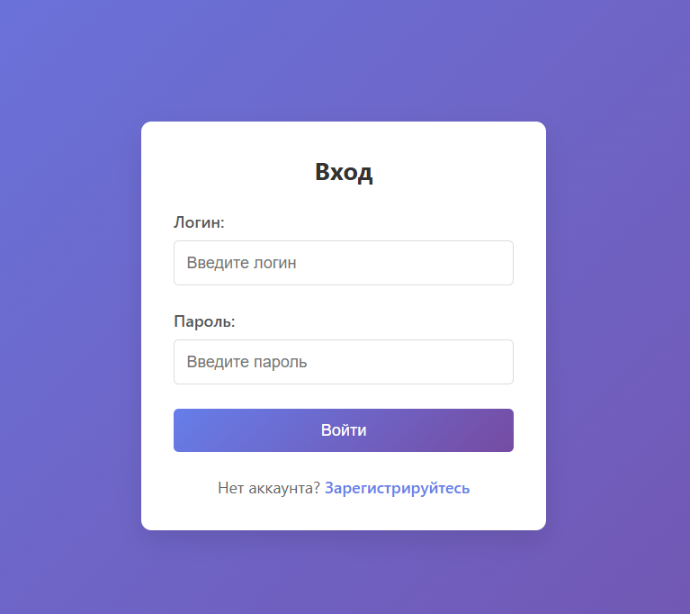
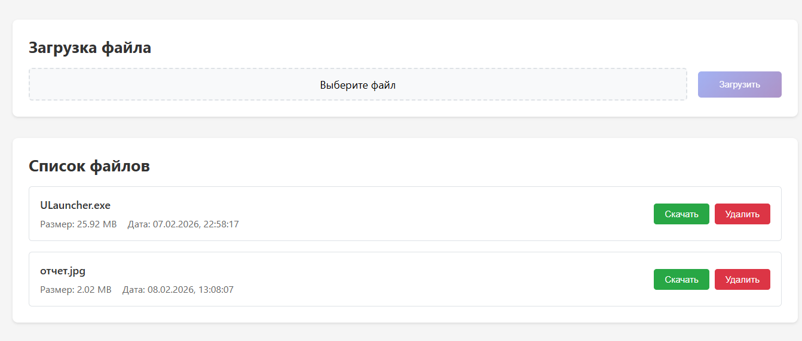
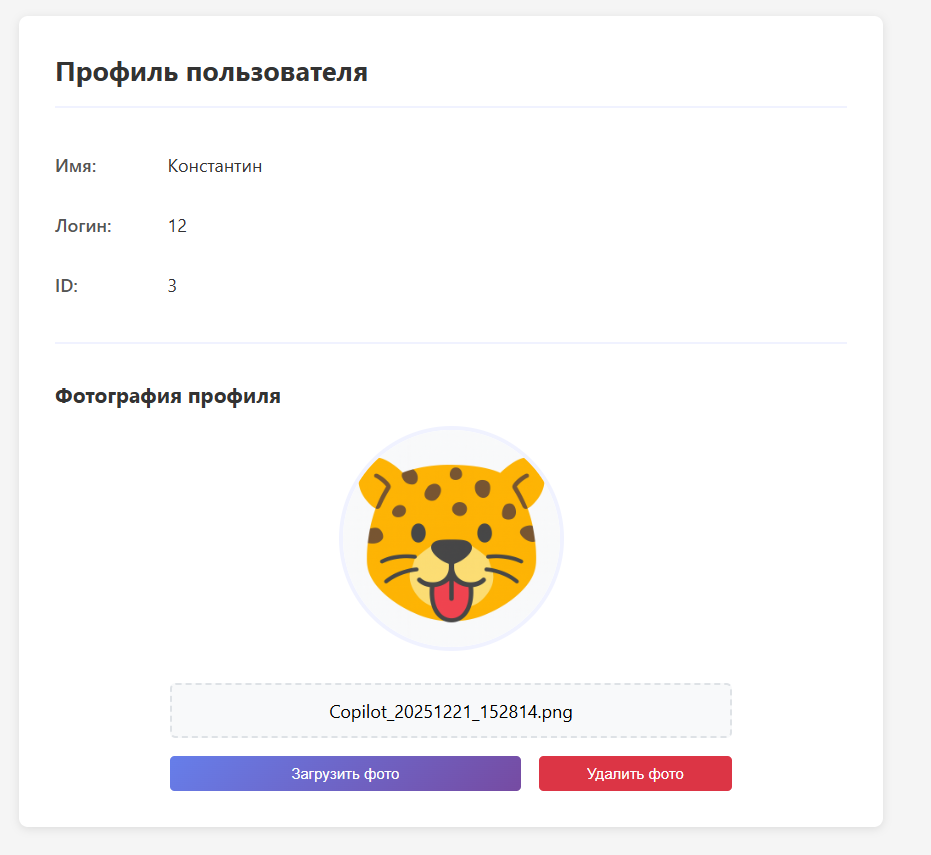

# 📁 File Server API с PostgreSQL

Файловый сервер с аутентификацией пользователей, поддержкой загрузки файлов и фотографий

## 📦 Зависимости

.NET 8, c пакетами NuGet:

* `Microsoft.EntityFrameworkCore`
* `Microsoft.EntityFrameworkCore.Tools`
* `Microsoft.EntityFrameworkCore.Design`
* В сочетании с postgres: `Npgsql.EntityFrameworkCore.PostgreSQL`

`Scrutor` добавлен через `dotnet add package Scrutor`

## Настройка БД

в файле `Startup.cs` строка подключения

```var connectionString = "Server=localhost;Port=5432;Database=file-service;User Id=postgres;Password=rootroot;";```
## Миграция
**обновить Visual Studio и .net (sdk)**

В проекте открыть терминал (ctrl + ё)

прописать:
``` 
cd [название проекта]
 dotnet ef migrations add InitialCreate
 dotnet ef database update
```
## Директории для хранения

в файле `Startup.cs` метод `CreateUploadDirectories()`, который создает директории для хранения файлов:

```
wwwroot/
└── uploads/
	 ├── files/      # Все загруженные файлы
	 │   ├── документ\\\_20231201120000.pdf
	 │   └── архив\\\_20231201120100.zip
	 └── photos/     # Фотографии пользователей
	     ├── photo1\\\_20231201120200.jpg
	     └── photo2\\\_20231201120300.png
```
## Структура проекта
```
FileServer/
├── Controllers/           # API контроллеры
│   ├── FileController.cs  # API для работы с файлами
│   └── UserController.cs  # API для работы с пользователями
├── Entity/               # Сущности и DTO
│   ├── FileData.cs       # Модель файла
│   └── User.cs          # Модель пользователя
├── Repository/          # Репозитории (доступ к БД)
│   ├── FileRepository.cs
│   └── UserRepository.cs
├── Service/            # Бизнес-логика
│   ├── FileService.cs  # Сервис файлов
│   └── UserService.cs  # Сервис пользователей
├── wwwroot/           # Статические файлы
│   └── uploads/       # Загруженные файлы
│       ├── files/     # Обычные файлы
│       └── photos/    # Фотографии
├── Program.cs         # Точка входа
├── Startup.cs         # Конфигурация
├── ApplicationContext.cs # Контекст БД
└── FileServer.csproj  # Файл проекта
```
## 🌐 API Endpoints
### 👤 User API (Пользователи)

| Метод | Endpoint | Описание | Тело запроса | Ответ | Параметры |
|-------|----------|----------|--------------|-------|-----------|
| `POST` | `/register` | Регистрация нового пользователя | `{"name":"string","login":"string","password":"string"}` | `User` объект | - |
| `POST` | `/login` | Аутентификация пользователя | `{"login":"string","password":"string"}` | `User` объект или `null` | - |
| `GET` | `/{id}` | Получить пользователя по ID | - | `User` объект (без пароля) | `id: long` |
### 📁 File API (Файлы)
| Метод | Endpoint | Описание | Тело запроса | Ответ | Параметры |
|-------|----------|----------|--------------|-------|-----------|
| `GET`| `/files` | Получить список всех файлов | - | `FileData\[]` массив | - |
| `GET`| `/download/{id}` | Скачать файл по ID | - | Файл (бинарные данные) | `id: long` |
| `POST` | `/upload-file` | Загрузить файл на сервер | FormData: `file` (IFormFile) | `FileData` объект | - |
| `POST` | `/upload-photo` | Загрузить фото пользователя | FormData: `userId` (long), `file` (IFormFile) | `FileData` объект | - |
| `POST` | `/delete-photo` | Удалить фото пользователя | `User` объект | `boolean` (успех/неудача) | - |
| `DELETE` | `/delete/{id}` | Полностью удалить файл | - | `{"message": "string"}` | `id: long` |

## 🗃️ Структура данных
### 📊 Таблица `FileData` (файлы)

| Поле | Тип | Nullable | Описание | Пример значения |
|------|-----|----------|----------|-----------------|
| `Id`| `long` | ❌ | Первичный ключ, автоинкремент | `1` |
| `Name` | `string` | ✅ | Оригинальное имя файла | `"документ.pdf"` |
| `RealName` | `string` | ✅ | Физическое имя файла на диске | `"документ\_20231201120000.pdf"` |
| `Path` | `string` | ✅ | Относительный путь к файлу | `"uploads/files/документ\_20231201120000.pdf"` |
| `UploadDate` | `DateTime` | ✅ | Дата и время загрузки (UTC) | `2023-12-01T12:00:00Z` |
| `Type`| `string` | ✅ | MIME-тип файла | `"application/pdf"` |
| `Size` | `long` | ✅ | Размер файла в байтах | `1048576` (1 MB) |
| `IsDeleted` | `bool` | ✅ | Флаг мягкого удаления | `false` |

### 👤 Таблица `User` (пользователи)
| Поле | Тип | Nullable | Описание | Пример значения |
|------|-----|----------|----------|-----------------|
| `Id` | `long` | ❌ | Первичный ключ, автоинкремент | `1` |
| `Name` | `string` | ✅ | Полное имя пользователя | `"Иван Иванов"` |
| `Login` | `string` | ✅ | Уникальный логин для входа | `"ivanov"` |
| `Password` | `string` | ✅ | Пароль (в открытом виде) | `"secure123"` |
| `Photo` | `string` | ✅ | Путь к фотографии профиля | `"uploads/photos/photo\_20231201120000.jpg"` |

## Demo




